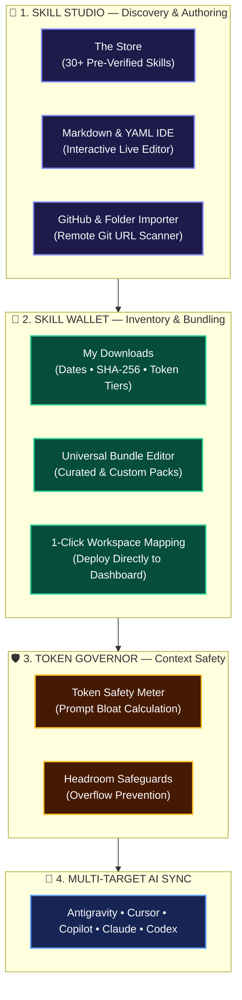
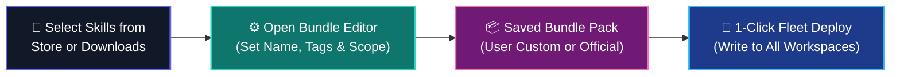
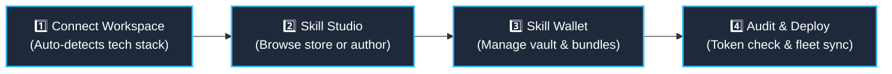
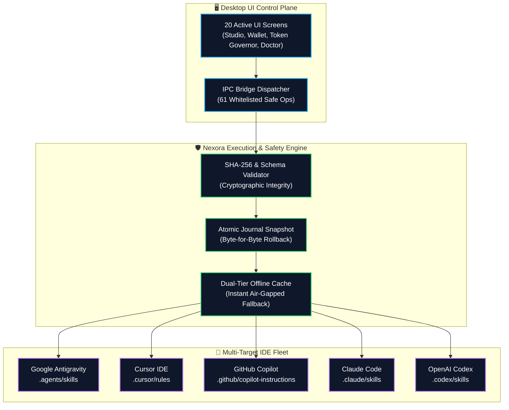

# Nexora Skills Manager

<p align="center">
  <b>The Native Windows Desktop Control Plane for AI Agent Skills, Rules & Multi-IDE Fleet Synchronization.</b>
</p>

<p align="center">
  <a href="https://github.com/abhishek01032007-pixel/Nexora/releases/latest"></a>
  <a href="#-system-requirements--prerequisites"></a>
  <a href="#-option-1-one-command-automated-setup"></a>
  <a href="#-enterprise-safety--atomic-rollback-guarantee"></a>
  <a href="LICENSE"></a>
</p>

---

## 💡 What is Nexora Skills Manager?

**Nexora Skills Manager** is a dedicated native Windows desktop application that unifies and controls AI agent skills, rules, and prompts across your development workspace.

Modern AI engineering is fragmented across multiple competing configuration formats:
* **Google Antigravity** requires `.agents/skills/<skill>/SKILL.md` with YAML metadata
* **Cursor IDE** compiles `.cursor/rules/<skill>.mdc` instruction files
* **GitHub Copilot** relies on fenced sections in `.github/copilot-instructions.md`
* **Claude Code** manages `.claude/skills/<skill>/SKILL.md`
* **OpenAI Codex** executes `.codex/skills/<skill>/SKILL.md`

Nexora eliminates configuration drift and manual copy-pasting by providing a **single, local command center** to discover, download, bundle, test, and synchronize agent skills across all 5 platforms simultaneously.

---

## 📥 Download & Installation Options

Choose your preferred way to install and run Nexora Skills Manager:

| Distribution Channel | Method / Command | Description |
| :--- | :--- | :--- |
| 💾 **Graphical Installer (`.exe`)** | [**Download Setup.exe (v1.2.0)**](https://github.com/abhishek01032007-pixel/Nexora/releases/download/v1.2.0/NexoraSkillsManager-Setup.exe) | Complete graphical setup with Start Menu shortcuts & automatic updates |
| 📦 **Windows Package Manager** | `winget install Nexora.NexoraSkillsManager` | Automated silent installation via native Windows Package Manager |
| ⚡ **One-Command Web Setup** | `irm https://raw.githubusercontent.com/.../setup.ps1 \| iex` | Fast, non-elevated installation to `%LOCALAPPDATA%\NexoraSkillsManager` |
| 📁 **Portable ZIP (x64)** | [**Download Portable ZIP**](https://github.com/abhishek01032007-pixel/Nexora/releases/download/v1.2.0/NexoraSkillsManager-1.2.0-win-x64.zip) | Zero-install standalone archive. Extract anywhere and launch immediately |

---

## ⚡ Quickstart Setup Commands

### Option 1: One-Command Automated Setup
Run in **Windows PowerShell** (non-elevated):
```powershell
irm https://raw.githubusercontent.com/abhishek01032007-pixel/Nexora/main/setup.ps1 | iex
```

Or run in **Windows Command Prompt (CMD)**:
```cmd
powershell -ExecutionPolicy Bypass -Command "irm https://raw.githubusercontent.com/abhishek01032007-pixel/Nexora/main/setup.ps1 | iex"
```

### Option 2: WinGet Terminal Install
```powershell
winget install Nexora.NexoraSkillsManager
```

> [!NOTE]
> #### 📌 System Requirements & Prerequisites
> * **Operating System:** Windows 10 & 11 (64-bit)
> * **Runtime:** Windows PowerShell 5.1+ (Native Windows built-in — **No Node.js or Python installations required on user machines**)
> * **Installation Scope:** 100% non-elevated per-user installation (`%LOCALAPPDATA%\NexoraSkillsManager`)
> * **Disk Footprint:** ~150 MB
> * **Cryptographic Integrity:** Strict SHA-256 hash verification before package extraction
> * **Environment:** Automatically configures `nexora` in your User PATH

---

## 🎨 UI/UX & Core Features Showcase



### 1. 📥 Skill Download & Vault Management
* **1-Click Downloads:** Download official verified skills from **The Store** or import remote skills directly from GitHub repositories.
* **Skill Vault ("My Downloads"):** Every downloaded skill is indexed in your local vault with:
  * 📅 **Acquisition Timestamp:** Track exact installation dates and SemVer history.
  * 🔒 **SHA-256 Cryptographic Checksum:** Guarantees tamper-proof skill files.
  * 🏷️ **Rule & Capability Badges:** See prompt instructions, tool dependencies, and category tags at a glance.
  * ⚖️ **Token Weight Tier:** Classified into *Lean*, *Standard*, or *Pro* context weights.
* **1-Click "Add to Workspace":** Deploy any downloaded skill directly from your vault into an active workspace with instantaneous dashboard navigation.

---

### 2. 📦 Bundle Creation & Collaboration Features

Nexora allows developers to group skills into cohesive engineering stacks, making team onboarding and multi-project setup seamless:



#### 🛠️ How to Create & Deploy a Custom Bundle:
1. **Open Skill Wallet:** Click on **Skill Wallet** in the primary navigation sidebar.
2. **Click "New Custom Bundle":** Enter your bundle title (e.g., `Full-Stack Web Suite` or `Mobile Security Stack`).
3. **Select Included Skills:** Pick desired skills from **My Downloads** or **The Store**. The real-time token governor calculates the cumulative context weight.
4. **Save & Customize:** Save the bundle locally. You can customize rule overrides, add notes, or fork pre-configured official bundles.
5. **1-Click Apply to Workspace:** Click **`Apply Bundle to Workspace`** to deploy all bundled skills across your project workspace in one transactional write.

#### 🛡️ Pre-Configured Official Bundles:
* 🌐 **Full-Stack Web Pack:** React 19, Next.js, Node.js Backend, UI/UX Pro Max.
* 🛡️ **Security Hardened Pack:** Backend Security Coder, OWASP Security Audit, Secrets Scanner.
* 📱 **Mobile Multiplatform Pack:** Flutter Responsive, React Native, Swift iOS, Kotlin Android.
* ☁️ **DevOps & Cloud Pack:** Docker, Kubernetes, Terraform, CI/CD, Performance Optimization.
* 🏛️ **Architecture & Clean Code Pack:** Software Architecture, Code Review Excellence, Debugger.

---

### 3. 🤖 Complete 5-Platform AI Target Matrix
Write your rules once in standard `SKILL.md` format; Nexora compiles and generates target instructions simultaneously:

| AI Agent Target | Generated File Location | Format & Capabilities |
| :--- | :--- | :--- |
| **Google Antigravity** | `.agents/skills/<skill>/SKILL.md` | Native Antigravity skill structure with validated YAML frontmatter |
| **Cursor IDE** | `.cursor/rules/<skill>.mdc` | Modular Cursor rule files with glob pattern matching |
| **GitHub Copilot** | `.github/copilot-instructions.md` | Isolated delimiter fences preserving custom environment variables |
| **Claude Code** | `.claude/skills/<skill>/SKILL.md` | Anthropic native multi-skill directory structure |
| **OpenAI Codex** | `.codex/skills/<skill>/SKILL.md` | Execution instruction sets with token-lean framing |

---

### 4. 🛡️ Token Safety Governor & Context Meter
* **Prompt Weight Calculation:** Automatically analyzes character, word, and token counts for each skill.
* **Context Budget Safeguard:** Visual meter alerts you before a skill set bloats agent context windows, preventing latency and runaway LLM costs.

---

### 5. 🔄 Batch Update Center & Atomic Rollbacks
* **SemVer Drift Detection:** Automatically detects upstream updates across your installed skills.
* **3-Way Checksum Diff Viewer:** Side-by-side inspection of local modifications vs. upstream releases.
* **100% Byte-for-Byte Atomic Rollback:** Backed by transactional journal snapshots. If an update fails, changes are reverted cleanly with zero project corruption.

---

### 6. 🎨 Multi-Theme Engine
* **System Theme (Auto-Sync):** Dynamically follows Windows light/dark system mode.
* **White Normal Mode (Daylight Clean):** High-contrast `#ffffff` foundation with deep slate typography and full WCAG AA contrast compliance.
* **Dark Mode (Charcoal Slate):** Developer-favorite `#13131b` deep foundation with violet accents.
* **Zero-Flash Startup:** Fast rendering before first DOM paint.

---

### 7. 🩺 6-Category System Doctor
* Real-time diagnostics across runtime files, platform adapters, environment variables, folder permissions, and bridge health with **1-click automated repair**.

---

### 8. 🔒 100% Local-First Sovereignty
* **100% Local Processing:** Scanning, parsing, and compilation execute entirely on your machine.
* **Zero Telemetry:** Never transmits your project files, code, or personal data.
* **Zero Secret Storage:** Never stores API keys, access tokens, or credentials.

---

## 🚀 How to Use (4-Step Workflow)



1. **Connect Workspace:** Select your project folder. Nexora automatically analyzes dependencies and configures active AI agent targets.
2. **Explore Skill Studio:** Browse verified skills in **The Store**, author custom instructions in the built-in **Markdown IDE**, or import from external Git repositories.
3. **Manage Skill Wallet:** Review **My Downloads** with timestamps and hashes. Create custom bundles or fork official packs, then map them directly to workspaces.
4. **Audit & Fleet Sync:** Verify token budgets in the **Token Governor**, then deploy atomically across all 5 AI agent targets in parallel.

---

## 📦 Official Skill Catalog

Nexora ships with an expanding catalog of **30+ official pre-verified skills** curated across 6 core software engineering domains:

| Category | Coverage Scope |
| :--- | :--- |
| 🌐 **Frontend & UI/UX** | React 19, Next.js, Design Systems, Mobile (Flutter, React Native, Swift, Kotlin) |
| ⚙️ **Backend & Microservices** | REST/gRPC API Architecture, Node.js, FastAPI, Go, Rust Systems |
| 🛡️ **Security & Auditing** | OWASP Top 10 Scanning, Secrets Scanner, Auth Hardening |
| 🧪 **Quality Assurance (QA)** | Unit Testing, Widget Testing, Regression Suites, Scientific Debugger |
| 🗄️ **Database & Architecture** | PostgreSQL Optimization, Supabase RLS, Clean Architecture Patterns |
| ☁️ **DevOps & Cloud** | Docker, Kubernetes, CI/CD Workflows, Web Performance Optimization |

> The official catalog is automatically synchronized directly with our public catalog index ([`catalog/skills-index.json`](catalog/skills-index.json)) with dual-tier offline cache fallback.

---

## 📊 Platform Architecture & Operational Flow



### 🛡️ Enterprise Safety & Atomic Rollback Guarantee
* **100% Test Suite Pass Rate:** All 102 test suites pass cleanly across backend cmdlets, desktop bridge, and user interface.
* **100% Byte-for-Byte Atomic Rollback:** If an installation is interrupted or fails, the engine restores the previous project state byte-for-byte.
* **Zero `Invoke-Expression`:** The IPC dispatcher strictly matches incoming requests against an allowlist of 61 predefined operations to prevent arbitrary command execution.
* **Offline-First Resilience:** If GitHub is unreachable, Nexora transparently serves the local offline cache without blocking developer workflows.

---

## 🤝 Community, Collaboration & Repository Structure

Nexora operates under a dual-repository development model to provide open community access while maintaining security and stability for our core desktop engine:

### 🌐 1. Public Repository (`Nexora`) — Open Distribution & Community Hub
This public repository serves as the official distribution channel and community gateway:
* **Binary Releases:** Access official installer releases, release notes, and SHA-256 checksums.
* **Skill Catalog Contributions:** Submit, improve, or propose new agent skills directly to `/catalog` via Pull Requests.
* **Issues & Bug Reports:** Open an [Issue](https://github.com/abhishek01032007-pixel/Nexora/issues) to propose new IDE targets, suggest improvements, or report bugs.

### 🔒 2. Private Repository (`Nexora-Skills-Manager`) — Core Engine Collaboration
The core desktop application shell, Electron bridge, and PowerShell execution engine are managed in our private source repository.

* **Interested in collaborating on the core engine?**  
  We welcome developers passionate about AI agent architecture, desktop engineering, and PowerShell performance optimization:
  * **Option A (Email):** Reach out to the maintainers with your background, interests, and proposed contributions.
  * **Option B (Collaboration Request):** Submit an issue on this repository with the label `collaboration-request` outlining the area of the engine you would like to work on. Verified contributors will be granted access to the private repository.

---

## 📄 License

Nexora Skills Manager public distribution and catalog are released under the [MIT License](LICENSE).
