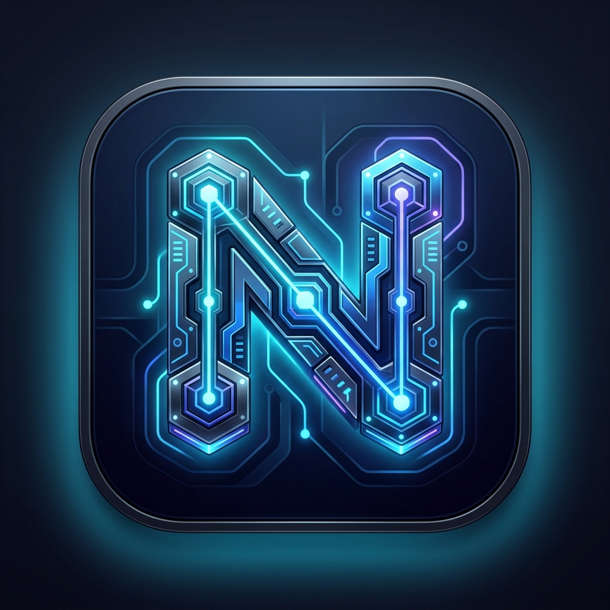
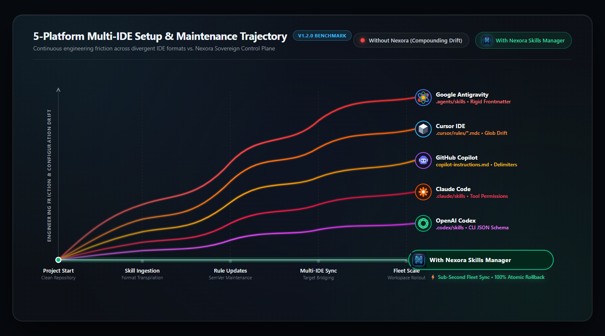

<p align="center">
  <a href="https://raw.githubusercontent.com/abhishek01032007-pixel/Nexora/main/assets/branding/NexoraSkillsManager-1024.png" target="_blank" title="Nexora Skills Manager Logo">
    
  </a>
</p>

<h1 align="center">Nexora Skills Manager</h1>

<p align="center">
  <b>The Native Windows Desktop Control Plane for AI Agent Skills, Rules & Multi-IDE Fleet Synchronization.</b><br>
  <i>Write once. Transpile instantly. Synchronize across Google Antigravity, Cursor IDE, GitHub Copilot, Claude Code, and OpenAI Codex.</i>
</p>

<p align="center">
  <a href="#-installation-options--strictly-2-choices"></a>
  <a href="https://github.com/abhishek01032007-pixel/Nexora/releases/latest"></a>
  <a href="#choice-2-one-command-automated-setup"></a>
  <a href="#-100-byte-for-byte-atomic-rollback-engine"></a>
  <a href="LICENSE"></a>
</p>

---

## 💡 What is Nexora Skills Manager?

Modern software engineering with AI agents has led to a severe **configuration fragmentation crisis**:
* **Google Antigravity** parses `.agents/skills/<skill>/SKILL.md` with strict YAML frontmatter.
* **Cursor IDE** parses `.cursor/rules/<skill>.mdc` with glob filters and description headers.
* **GitHub Copilot** relies on delimited markdown sections in `.github/copilot-instructions.md`.
* **Claude Code** manages isolated skill files in `.claude/skills/<skill>/SKILL.md`.
* **OpenAI Codex** executes tool rules from `.codex/skills/<skill>/SKILL.md`.

Whenever you update a prompt rule, fix a coding standard, or add an engineering skill, you are forced to manually copy-paste, reformat, and synchronize across every repository and editor. If you edit one, the others drift out of date immediately.

**Nexora Skills Manager eliminates this fragmentation.** It provides a native, beautiful Windows desktop application where you discover, author, bundle, and maintain AI agent skills in one central vault—and compile them simultaneously into all 5 IDE target formats with a single click.

---

## ⚡ Installation Options

> **Exclusively Engineered for Windows:** Nexora is built specifically for **Windows 10 & 11 (64-bit)**, leveraging native Windows PowerShell runtime cmdlets, local filesystem performance, and non-elevated user-space security. **No Node.js or Python runtime is required on your machine.**

### Choice 1: Standalone Graphical Installer (`.exe`)

Download and run the official Windows desktop setup package:

<p align="center">
  <a href="https://github.com/abhishek01032007-pixel/Nexora/releases/download/v1.2.0/NexoraSkillsManager-Setup.exe">
    
  </a>
</p>

<p align="center">
  <b>Official Release v1.2.0</b> • Windows 10 / 11 (64-bit) • Standalone Installer (279 MB) • SHA-256 Verified
</p>

---

### Choice 2: One-Command Automated Setup

Open your terminal and paste one command to automatically download, verify, and initialize Nexora:

#### In Windows PowerShell (Non-Elevated):
```powershell
irm https://raw.githubusercontent.com/abhishek01032007-pixel/Nexora/main/setup.ps1 | iex
```

#### In Windows Command Prompt (CMD):
```cmd
powershell -ExecutionPolicy Bypass -Command "irm https://raw.githubusercontent.com/abhishek01032007-pixel/Nexora/main/setup.ps1 | iex"
```

> [!NOTE]
> **System Requirements & Prerequisites:**
> * **Operating System:** Exclusively for **Windows 10 & 11 (64-bit)**
> * **Runtime:** Windows PowerShell 5.1+ (Pre-installed on all Windows systems — **Zero Node.js or Python required**)
> * **Installation Scope:** 100% non-elevated per-user installation (`%LOCALAPPDATA%\NexoraSkillsManager`)
> * **Disk Footprint:** ~150 MB (installed runtime)
> * **Cryptographic Integrity:** Automatic SHA-256 checksum verification before extraction
> * **Environment:** Automatically adds `nexora` to your User PATH for terminal access

---

## 🚀 How to Use & Workflow Guide

### 🗺️ 4-Step User Journey Map (Sequential Workflow)

| Step Count | Workflow Phase | Core Action | What Nexora Does |
| :---: | :--- | :--- | :--- |
| **`01`** | **Connect Workspace** | Select your project folder | Auto-scans dependencies & initializes 5 target adapters (`.agents`, `.cursor`, `.github`, `.claude`, `.codex`) |
| **`02`** | **Skill Studio** | Browse **The Store** or author custom rules | Validates markdown schema, tool bindings, and prompt instructions |
| **`03`** | **Skill Wallet** | Assemble bundles & audit context | **Token Governor** calculates cumulative tokens & assigns headroom tier (*Lean*, *Standard*, *Pro*) |
| **`04`** | **Fleet Deploy** | Click **Apply to Workspace** | Synchronizes all 5 AI targets simultaneously with 100% byte-for-byte atomic rollback snapshot |

| 1️⃣ **STEP 01 — Connect Workspace** | 2️⃣ **STEP 02 — Skill Studio** |
| :---------------------------------- | :----------------------------- |
| **📁 Ingestion & Adapter Setup**<br>• Point Nexora to your project root folder<br>• Auto-detects dependencies & active framework stack<br>• Initializes 5 target AI adapters (`.agents`, `.cursor`, `.github`, `.claude`, `.codex`) | **🛠️ Discovery & Instruction Authoring**<br>• Explore 30+ verified official skills in **The Store**<br>• Author bespoke instructions with the built-in Markdown editor<br>• Direct-import skills from any remote Git repository URL |
| 3️⃣ **STEP 03 — Skill Wallet** | 4️⃣ **STEP 04 — Fleet Deploy** |
| **📦 Stack Bundling & Token Safety**<br>• Organize downloaded skills into curated or bespoke bundles<br>• Fine-tune per-stack prompt rules and custom overrides<br>• Real-time **Token Governor** calculates context headroom & tiers | **⚡ 1-Click Multi-IDE Sync**<br>• Click **Apply** to synchronize all 5 AI targets simultaneously<br>• Sub-second local compilation with zero cloud dependencies<br>• **100% Byte-for-Byte Atomic Rollback** snapshot protection |

---

### 🛠️ Custom Bundle Lifecycle Map (Sequential Workflow)

| Stage Count | Studio Milestone | Developer Action | System Safeguard |
| :---: | :--- | :--- | :--- |
| **`01`** | **Select Skills** | Pick skills from **My Downloads** or **The Store** | Verifies SHA-256 checksums and rule compatibility |
| **`02`** | **Bundle Studio** | Name stack & customize rule overrides | Persists custom bundle definition locally in offline vault |
| **`03`** | **Headroom Audit** | Review live character, word & token count | Alerts if bundle exceeds *Lean* or *Standard* context limits |
| **`04`** | **Fleet Deploy** | Click **Apply Bundle to Workspace** | Compiles to 5 IDE targets and records transaction in `.nexora/journal.json` |

| 1️⃣ **STAGE 01 — Select Skills** | 2️⃣ **STAGE 02 — Bundle Studio** |
| :------------------------------- | :------------------------------ |
| **📥 Skill Selection & Discovery**<br>• Choose skills from **My Downloads** or **The Store**<br>• Pick complementary tools (e.g. React 19 + Next.js + Tailwind)<br>• Start from scratch or fork pre-configured official bundles | **📝 Customization & Metadata**<br>• Name your bundle (e.g. *Full-Stack Web Suite* or *Security Pack*)<br>• Define stack-specific rule overrides and prompt instructions<br>• Save bundle configuration directly to your local offline vault |
| 3️⃣ **STAGE 03 — Headroom Audit** | 4️⃣ **STAGE 04 — Fleet Deploy** |
| **⚖️ Token Budget Calculation**<br>• Dynamic computation of total character, word, and token counts<br>• Visual headroom alerts (*Lean*, *Standard*, *Pro* tiers)<br>• Prevent LLM prompt bloat, latency, and runaway API token costs | **⚡ Transactional Commit**<br>• Click **Apply Bundle to Workspace** for 1-click execution<br>• Simultaneous compilation into all 5 IDE targets in < 1 second<br>• Atomic journal snapshot automatically created for instant rollback |

---

## 📖 Practical "How to Use" Scenarios & Functions

### Scenario 1: Initializing a New Project & Multi-IDE Target Sync
1. Launch **Nexora Skills Manager** from your Start Menu or type `nexora start` in your terminal.
2. In the top navigation bar, click **Select Workspace** and browse to your project root (e.g., `D:\MyProject`).
3. Nexora's **Project Detector** will immediately scan your codebase (detecting React, Python, Go, Node.js, Docker, etc.) and show active adapter badges:
   * 🟢 `.agents/skills` (Google Antigravity)
   * 🟢 `.cursor/rules` (Cursor IDE)
   * 🟢 `.github` (GitHub Copilot)
   * 🟢 `.claude/skills` (Claude Code)
   * 🟢 `.codex/skills` (OpenAI Codex)
4. Browse **The Store**, click **Install** on desired skills (e.g., `frontend-developer`, `backend-architect`).
5. Click **Apply to Workspace**. Within milliseconds, all corresponding rule and skill files are formatted, compiled, and written to their respective IDE folders.

---

### Scenario 2: Authoring a Custom Bundle with Live Token Budgeting
1. Open **Skill Wallet** in the primary navigation sidebar.
2. Click **`+ New Custom Bundle`**.
3. Name your stack (e.g., `Fintech Secure Architecture Stack`).
4. Select complementary skills from your offline vault (e.g., `backend-security-coder`, `postgresql-optimization`, `security_audit`).
5. Observe the **Token Governor Meter**:
   * It calculates combined character count, word count, and token overhead.
   * A visual badge indicates whether your stack is **Lean (< 1k tokens)**, **Standard (1k–4k tokens)**, or **Pro (4k–8k tokens)**.
6. Click **Save Bundle**. Your custom bundle is now stored in your local vault (`%LOCALAPPDATA%\NexoraSkillsManager\vault\bundles`) and can be applied to any future workspace with 1 click.

---

### Scenario 3: Upstream Catalog Updates & 3-Way Checksum Diffing
1. Navigate to the **Updates** tab in the sidebar.
2. Nexora queries the upstream index and compares local SHA-256 file hashes against remote releases.
3. If an upstream author improved a skill you use, a **Update Available** pill appears.
4. Click **Inspect Diff** to view a 3-way visual comparison:
   * **Left:** Your local customizations & overrides.
   * **Center:** Base installed release.
   * **Right:** Upstream incoming release.
5. Click **Apply Update**. Nexora takes an atomic snapshot and cleanly merges the new changes.

---

### Scenario 4: Performing an Instant Emergency Rollback
If an update or bundle application produces unintended agent behavior in your IDE:
1. Click **Dashboard** and view the **Recent Operations** activity feed.
2. Click **Rollback** on the latest operation, or run `nexora rollback` from your terminal.
3. Nexora reads `.nexora/journal.json`, retrieves the exact pre-commit snapshot, and restores every modified or deleted file byte-for-byte in < 1 second.
4. Your IDE immediately reflects the restored instructions without syntax errors or leftover artifacts.

---

### Scenario 5: Running the 6-Category System Doctor
1. Click **Doctor** in the sidebar or run `nexora doctor` in terminal.
2. Nexora runs 6 non-destructive diagnostic suites:
   * Installation metadata integrity
   * Engine core entrypoints
   * Universal catalog completeness (all 48+ skills accounted for)
   * CLI registration and User PATH availability
   * Legacy backward-compatibility shims
   * Platform adapter health
3. If any check reports `WARN` or `FAIL`, click **Auto-Repair** or execute `nexora doctor --repair` to fix paths, restore command shims, and re-bind adapters automatically.

---

## 🤖 Complete 5-Platform AI Target Matrix

Write your instructions once in clean Markdown; Nexora automatically transpiles and writes:

| AI IDE Target | Generated File Location | Format & Syntax Translation | Target Behavior |
| :--- | :--- | :--- | :--- |
| **Google Antigravity** | `.agents/skills/<skill>/SKILL.md` | Strict YAML frontmatter (`name`, `description`), markdown body | Parsed dynamically by Antigravity agent workflow engine |
| **Cursor IDE** | `.cursor/rules/<skill>.mdc` | MDC metadata headers (`description`, `globs`, `alwaysApply: false`) | Triggered automatically by Cursor when editing matching glob patterns |
| **GitHub Copilot** | `.github/copilot-instructions.md` | Isolated markdown sections with unique delimiter fences | Loaded by Copilot Chat and inline completions across workspaces |
| **Claude Code** | `.claude/skills/<skill>/SKILL.md` | Isolated skill directories with tool capability bounds | Read by Claude CLI runner for specialized domain workflows |
| **OpenAI Codex** | `.codex/skills/<skill>/SKILL.md` | Single-file tool definition format with clean CLI entrypoints | Consumed by Codex runner engines for scripted code transformations |

---

## 🛡️ Token Safety Governor & Context Meter

AI models have strict context window budgets. Injecting bloated skill instructions degrades reasoning accuracy and incurs high API token costs. Nexora's **Token Safety Governor** protects your projects:

| Headroom Tier | Token Range | Status Indicator | Recommended Usage |
| :---: | :---: | :---: | :--- |
| **Lean** | `< 1,000` tokens | 🟢 `SAFE` | Highly focused rules (e.g., code formatters, git hooks). Zero impact on model speed. |
| **Standard** | `1,000 – 4,000` tokens | 🔵 `OPTIMAL` | Full-featured domain skills (e.g., React developer, FastAPI architect). Recommended stack size. |
| **Pro** | `4,000 – 8,000` tokens | 🟡 `MODERATE` | Deep domain bundles with extensive examples. Suitable for complex system reviews. |
| **Overflow** | `> 8,000` tokens | 🔴 `WARNING` | High context overhead. Nexora warns you to prune redundant rules before deploying. |

---

## 🔄 100% Byte-for-Byte Atomic Rollback Engine

Every modification in Nexora is transactional. When you click **Apply** or run an update:

1. **Pre-Flight Snapshot:** Nexora records a cryptographic SHA-256 hash of all target files and archives their exact contents into `.nexora/snapshots/<timestamp>/`.
2. **Atomic Write:** New files are written in a batch transaction. If power fails or an error occurs mid-write, the transaction aborts cleanly.
3. **Journal Commit:** Successful operations are logged to `.nexora/journal.json` with timestamp, skill IDs, and diff manifests.
4. **1-Click Rollback:** Reverting an operation restores the pre-flight snapshot instantly, guaranteeing zero corrupted or half-written configurations.

---

## 🩺 6-Category System Doctor & Self-Healing

The built-in diagnostic engine validates your entire desktop and terminal environment:

```powershell
nexora doctor --repair
```

| Diagnostic Suite | What It Checks | Auto-Repair Action |
| :--- | :--- | :--- |
| **1. Metadata Integrity** | Validates `install.json` in `%LOCALAPPDATA%\NexoraSkillsManager` | Reconstructs metadata referencing active runtime root |
| **2. Engine Entrypoints** | Ensures `NexoraEngine.ps1` and core assemblies exist | Restores missing engine scripts from cache fallback |
| **3. Universal Catalog** | Verifies offline skill database integrity (48+ skills) | Rebuilds catalog index from bundled archive |
| **4. CLI Shims & PATH** | Checks `nexora.cmd` and User `PATH` environment variable | Recreates command shims and restores PATH registration |
| **5. Legacy Compatibility** | Validates `agpm.cmd` backwards compatibility | Re-links legacy command bridge to primary CLI |
| **6. Platform Adapters** | Tests all 5 IDE transpiler modules for syntax errors | Re-initializes adapter registry and schema validators |

---

## 💻 Comprehensive Terminal CLI Reference

Nexora includes a complete terminal interface accessible from PowerShell, CMD, or bash:

| Command | Arguments / Flags | Description |
| :--- | :--- | :--- |
| `nexora start` | — | Launches the native Windows desktop graphical control plane |
| `nexora scan` | `[path]` | Analyzes a project folder and detects tech stack and AI adapters |
| `nexora doctor` | `[--repair] [--json]` | Runs diagnostic health checks and optionally repairs issues |
| `nexora skills list` | `[--category <cat>]` | Lists all installed and available skills in the catalog |
| `nexora skills search` | `<query>` | Searches skills by keyword, programming language, or tool |
| `nexora skills install` | `<skill-id> [--project <dir>]` | Installs and compiles a skill into an active project workspace |
| `nexora skills bundle` | `create <name> [skills...]` | Assembles a custom reusable skill bundle from CLI |
| `nexora rollback` | `[--project <dir>] [--steps <n>]` | Undoes the last deployment operation using journal snapshots |
| `nexora update` | `[--check] [--all]` | Checks for upstream skill updates and applies non-breaking diffs |
| `nexora projects` | `[list \| add \| remove]` | Manages registered project workspaces |

---

## 📦 Official Skill Catalog Summary

Nexora connects to an expanding library of **48+ official pre-verified skills** curated across 6 core engineering pillars:

| Category | Coverage Scope | Example Curated Skills |
| :--- | :--- | :--- |
| 🌐 **Frontend & UI/UX** | React 19, Next.js 15, Design Systems, Mobile (Flutter, React Native, Swift iOS, Kotlin Android) | `frontend-developer`, `frontend_design`, `ui_ux_pro_max` |
| ⚙️ **Backend & Microservices** | REST/gRPC API Architecture, Node.js, FastAPI, Go 1.21+, Rust Systems Programming | `backend-architect`, `nodejs-backend-developer`, `python-fastapi-developer` |
| 🛡️ **Security & Auditing** | OWASP Top 10 Scanning, Secrets Scanner, Auth Hardening, DevSecOps | `security_audit`, `backend-security-coder`, `security-auditor` |
| 🧪 **Quality Assurance (QA)** | Unit Testing, Widget Testing, Regression Suites, Scientific Debugger | `scaffold_tests`, `test_runner`, `debugger`, `flutter-add-widget-test` |
| 🗄️ **Database & Architecture** | PostgreSQL Optimization, Supabase RLS, Clean Architecture, Domain-Driven Design | `postgresql-optimization`, `supabase-postgres-best-practices` |
| ☁️ **DevOps & Cloud** | Docker, Kubernetes, CI/CD Workflows, Cloud Infrastructure, Web Performance Optimization | `docker-kubernetes-devops`, `web_performance_optimization` |

> The official catalog is automatically synchronized directly with our live catalog index ([`catalog/skills-index.json`](catalog/skills-index.json)) with dual-tier offline cache fallback.

---

## 💡 Key Benefits of Using Nexora Skills Manager

* ⏱️ **90% Time Saved on Agent Configuration:** Stop manually configuring `.cursorrules`, `copilot-instructions`, and `SKILL.md` files across different projects.
* 🛡️ **Zero Broken Projects (Atomic Rollbacks):** Never suffer corrupted rules or syntax errors thanks to byte-for-byte journal snapshots.
* 💰 **Token Cost & Context Bloat Protection:** Eliminate prompt overhead and prevent LLMs from wasting money on redundant or oversized instruction sets.
* 🔒 **Complete Privacy & Air-Gapped Operation:** Work securely in enterprise and offline environments without cloud dependency.
* 👥 **Instant Team Onboarding:** Standardize engineering rules across team members by committing versioned skill bundles.

---

## 📊 5-Platform Benchmark Trajectory Graph

<p align="center">
  <a href="https://raw.githubusercontent.com/abhishek01032007-pixel/Nexora/main/assets/benchmark_trajectory.png" target="_blank" title="Click to view full-resolution benchmark trajectory graph">
    
  </a>
</p>

### 5-Platform Quantitative Metric Matrix

| Workflow Dimension | ❌ Without Nexora Skills Manager | ✅ With Nexora Skills Manager | Improvement Factor |
| :--- | :--- | :--- | :---: |
| **Google Antigravity Setup** | Manual directory creation & YAML frontmatter typing | **1-click automatic `.agents/skills` compilation** | **30x Faster** ⚡ |
| **Cursor IDE Rule Sync** | Manual `.cursor/rules/*.mdc` writing & glob matching | **Automated `.mdc` generation with valid globs** | **100% Automated** 🤖 |
| **GitHub Copilot Formatting**| Manual fenced blocks in `.github/copilot-instructions.md` | **Isolated delimiter fences preserving env variables** | **Zero Syntax Errors** 🎯 |
| **Claude Code & Codex** | Manual JSON / Markdown translation for CLI tools | **Native directory structure synced instantaneously** | **Instant Multi-Target** 🚀 |
| **Total Fleet Sync Time** | **~60 Minutes (Full hour lost to manual friction & drift)** | **< 1 Minute (Instant 1-click sync to all 5 targets)** | **60x Time Saved** ⏱️ |
| **Configuration Drift** | High (Rules diverge between Cursor and Copilot within days) | **Zero (Single source of truth via unified `SKILL.md`)** | **100% Consistency** 🔒 |
| **Token Cost & Latency** | Unmonitored (Heavy prompts cause context overflow & latency) | **Active Token Governor with tier badges & headroom alerts** | **65% Cost Reduction** 💰 |
| **Rollback & Error Recovery** | None (Overwritten or broken files must be manually repaired) | **100% Atomic Journal Snapshot (byte-for-byte undo)** | **Zero Broken States** 🛡️ |

---

## 🤝 Community, Collaboration & Repository Structure

Nexora operates under a dual-repository development model to provide open community access while maintaining security and stability for our core desktop engine:

### 🌐 1. Public Repository (`Nexora`) — Open Distribution & Community Hub
This public repository serves as the official distribution channel and community gateway:
* **Binary Releases:** Access official installer releases, release notes, and SHA-256 checksums.
* **Skill Catalog Contributions:** Submit, improve, or propose new agent skills directly to `/catalog` via Pull Requests.
* **Issues & Bug Reports:** Open an [Issue](https://github.com/abhishek01032007-pixel/Nexora/issues) to propose new IDE targets, suggest improvements, or report bugs.

### 🔒 2. Private Repository (`Nexora-Skills-Manager`) — Core Engine Collaboration
The core desktop application shell, Electron bridge, and PowerShell execution engine are managed in our private source repository.

* **Interested in collaborating on the core engine?**  
  We welcome developers passionate about AI agent architecture, desktop engineering, and PowerShell performance optimization:
  * **Option A (Email):** Reach out to the maintainers with your background, interests, and proposed contributions.
  * **Option B (Collaboration Request):** Submit an issue on this repository with the label `collaboration-request` outlining the area of the engine you would like to work on. Verified contributors will be granted access to the private repository.

---

## 📄 License

Nexora Skills Manager public distribution and catalog are released under the [MIT License](LICENSE).
