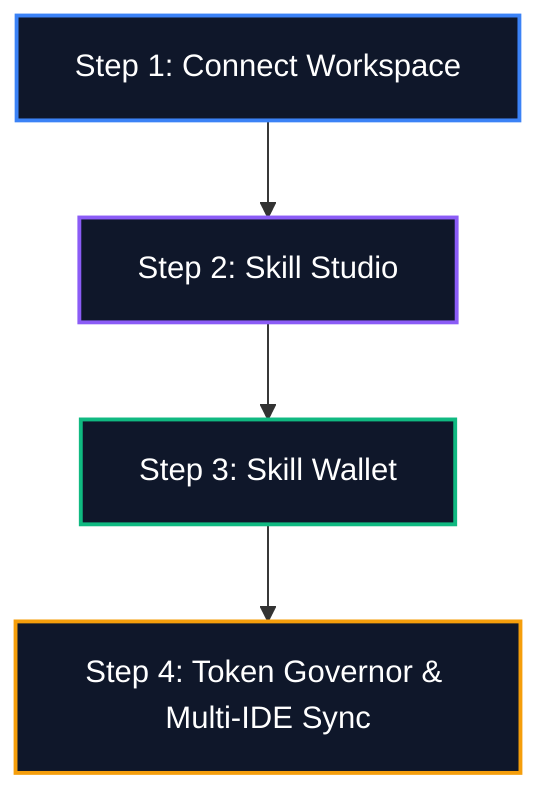
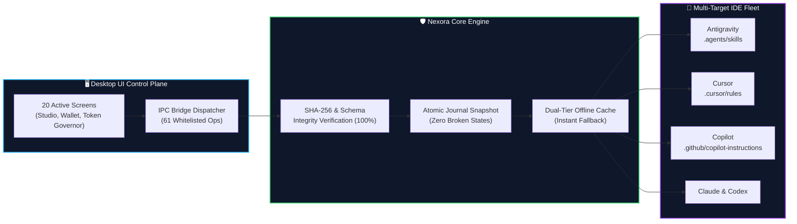

# Nexora Skills Manager

<p align="center">
  <b>The Native Windows Desktop Control Plane for AI Agent Skills, Rules & Multi-IDE Fleet Synchronization.</b>
</p>

<p align="center">
  <a href="https://github.com/abhishek01032007-pixel/Nexora/releases/latest"></a>
  <a href="#-system-requirements--prerequisites"></a>
  <a href="#-1-one-command-setup-powershell-51-or-cmd"></a>
  <a href="#-safety--atomic-rollback-guarantee"></a>
  <a href="LICENSE"></a>
</p>

---

## 💡 What is Nexora Skills Manager?

**Nexora Skills Manager** is a native Windows desktop application that unifies and controls AI agent skills, rules, and prompts across your entire developer workspace. 

Modern AI development is fragmented: Cursor uses `.cursor/rules`, GitHub Copilot uses `.github/copilot-instructions.md`, Google Antigravity uses `.agents/skills`, Claude Code uses `.claude/skills`, and OpenAI Codex uses `.codex/skills`. 

Nexora eliminates configuration drift and manual copy-pasting by providing a **single, local command center** to discover, author, test, and synchronize agent skills across all 5 platforms simultaneously.

### 🌟 Core Capabilities
* **🤖 5-Platform Matrix:** Write your skill once in standard `SKILL.md` format with YAML frontmatter; Nexora compiles and syncs it across **Google Antigravity**, **Cursor IDE**, **GitHub Copilot**, **Claude Code**, and **OpenAI Codex**.
* **🎨 Multi-Theme Desktop Engine:** Fully responsive daylight theme (*White Normal Mode* with WCAG AA compliance), developer-favorite *Charcoal Slate Dark Mode*, and real-time *System Theme Auto-Sync*.
* **🛡️ Token Safety Governor:** Real-time prompt token consumption monitoring and mathematical headroom safeguards to prevent context window bloat and runaway LLM costs.
* **🔄 Batch Update Center & Atomic Rollbacks:** Transactional, byte-for-byte journal snapshots ensure that if any skill update is interrupted or encounters an error, your project configuration is restored instantly with zero corruption.
* **🔒 100% Local & Sovereign:** All scanning, parsing, and deployments run strictly on your machine. **Zero telemetry, zero secret storage, and zero cloud dependency.**

---

## 📥 Direct Install

<p align="center">
  <a href="https://github.com/abhishek01032007-pixel/Nexora/releases/download/v1.2.0/NexoraSkillsManager-Setup.exe">
    
  </a>
</p>

### Alternative Installation Options
* **Windows Package Manager (WinGet):**
  ```powershell
  winget install Nexora.NexoraSkillsManager
  ```
* **Portable ZIP Archive:**  
  Download [`NexoraSkillsManager-1.2.0-win-x64.zip`](https://github.com/abhishek01032007-pixel/Nexora/releases/download/v1.2.0/NexoraSkillsManager-1.2.0-win-x64.zip) from the [latest release assets](https://github.com/abhishek01032007-pixel/Nexora/releases/latest) and extract to any folder.

---

## ⚡ One Setup Command

For developers who prefer an automated, single-command terminal setup:

### Windows PowerShell (Recommended)
```powershell
irm https://raw.githubusercontent.com/abhishek01032007-pixel/Nexora/main/setup.ps1 | iex
```

### Windows Command Prompt (CMD)
```cmd
powershell -ExecutionPolicy Bypass -Command "irm https://raw.githubusercontent.com/abhishek01032007-pixel/Nexora/main/setup.ps1 | iex"
```

> [!NOTE]
> #### 📌 System Requirements & Prerequisites
> * **Operating System:** Windows 10 & 11 (64-bit)
> * **Runtime:** Windows PowerShell 5.1+ (Native Windows built-in — **No Node.js or Python installations required**)
> * **Installation Scope:** 100% non-elevated per-user installation (`%LOCALAPPDATA%\NexoraSkillsManager`)
> * **Disk Footprint:** ~150 MB
> * **Integrity:** Strict cryptographic SHA-256 hash verification before package extraction
> * **Environment:** Automatically configures `nexora` in your User PATH

---

## 🚀 How to Use (4-Step Workflow)



1. **Step 1: Connect Workspace**  
   Launch Nexora and add your local Git repository or project folder. Nexora automatically analyzes project dependencies and identifies active AI configuration targets.
2. **Step 2: Explore Skill Studio**  
   Discover verified skills in **The Store**, author custom skills using the built-in **Markdown IDE** with YAML frontmatter validation, or import remote skills directly from GitHub URLs.
3. **Step 3: Manage Your Skill Wallet**  
   Inspect your personal vault with acquisition timestamps, SHA-256 integrity hashes, and token tiers. Group skills into custom or curated bundles (*Full-Stack, Security, Mobile, DevOps*) and deploy them to any workspace with **1-click mapping**.
4. **Step 4: Audit & Multi-IDE Sync**  
   Monitor context consumption in the **Token Governor** to prevent prompt bloat, then deploy atomically across your IDE fleet simultaneously.

---

## 📦 Official Skill Catalog

Nexora provides an expanding collection of **30+ official pre-verified skills** curated across 6 key software engineering domains:

| Category | Coverage Scope |
| :--- | :--- |
| 🌐 **Frontend & UI/UX** | React 19, Next.js, Design Systems, Mobile (Flutter, React Native, Swift, Kotlin) |
| ⚙️ **Backend & Microservices** | REST/gRPC API Architecture, Node.js, FastAPI, Go, Rust Systems |
| 🛡️ **Security & Auditing** | OWASP Top 10 Scanning, Secrets Scanner, Auth Hardening |
| 🧪 **Quality Assurance (QA)** | Unit Testing, Widget Testing, Regression Suites, Scientific Debugger |
| 🗄️ **Database & Architecture** | PostgreSQL Optimization, Supabase RLS, Clean Architecture Patterns |
| ☁️ **DevOps & Cloud** | Docker, Kubernetes, CI/CD Workflows, Web Performance Optimization |

> The official catalog is automatically synchronized directly with our public catalog index ([`catalog/skills-index.json`](catalog/skills-index.json)) with dual-tier offline cache fallback.

---

## 📊 Platform Reliability & Operational Flow

Nexora is engineered for enterprise-grade stability, ensuring your development environment is never left in a corrupted state:



### 🛡️ Safety & Atomic Rollback Guarantee
* **100% Test Suite Pass Rate:** All 102 test suites pass cleanly across backend cmdlets, desktop bridge, and user interface.
* **100% Byte-for-Byte Atomic Rollback:** In the event of network disruption, file lock, or syntax failure, the engine automatically rolls back changes to the prior snapshot.
* **Zero `Invoke-Expression`:** The IPC dispatcher strictly dispatches against an allowlist of 61 predefined operations to prevent arbitrary command injection.
* **Offline-First Resilience:** If GitHub is unreachable, Nexora transparently falls back to the local offline cache without blocking developer workflows.

---

## 🤝 Community, Collaboration & Repository Structure

Nexora operates under a dual-repository development model to provide open community access while maintaining security and stability for our core desktop engine:

### 🌐 1. Public Repository (`Nexora`) — Open Distribution & Community Hub
This public repository serves as the official distribution channel and community gateway:
* **Binary Releases:** Access official installer releases, release notes, and SHA-256 checksums.
* **Skill Catalog Contributions:** Submit, improve, or propose new agent skills directly to `/catalog` via Pull Requests.
* **Issues & Bug Reports:** Open an [Issue](https://github.com/abhishek01032007-pixel/Nexora/issues) to propose new IDE targets, suggest improvements, or report bugs.

### 🔒 2. Private Repository (`Nexora-Skills-Manager`) — Core Engine Collaboration
The core desktop application shell, Electron bridge, and PowerShell execution engine are managed in our private source repository.

* **Interested in collaborating on the core engine?**  
  We welcome developers passionate about AI agent architecture, desktop engineering, and PowerShell performance optimization:
  * **Option A (Email):** Reach out to the maintainers with your background, interests, and proposed contributions.
  * **Option B (Collaboration Request):** Submit an issue on this repository with the label `collaboration-request` outlining the area of the engine you would like to work on. Verified contributors will be granted access to the private repository.

---

## 📄 License

Nexora Skills Manager public distribution and catalog are released under the [MIT License](LICENSE).
